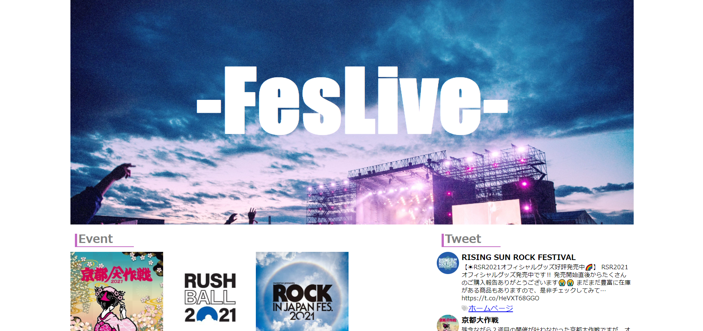

# FesLive

イベント情報の取得アプリです。

## Prerequisites

- Node.js 14.17.0
- Vue.js 4.5.13

## ページ一覧

## 各ページ機能・詳細
[イベント一覧](#list)

[イベントツイート一覧](#tweet)

[イベント詳細](#detail)

## イベント一覧(トップページ)

開催イベントの一覧を見ることができます。
クリックするとイベント詳細ページにとびます。

## イベントツイート一覧(トップページ)

イベントのtwitterのツイート一覧を見ることができます。
開催決定やチケット先行情報はtwitterからいち早く発表されるため、このページから確認することができます。

## イベント詳細

開催日や開催場所を確認することができます。

